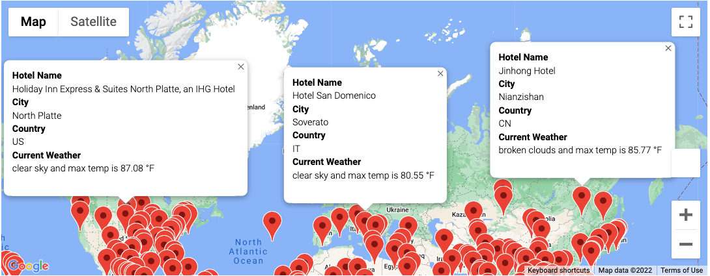
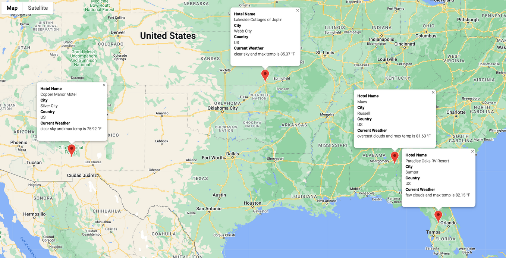

# World Weather Analysis

## Project Overview:

The goal of this project is to collect and present data based on customers preferred travel criteria in order to find their ideal hotel.  Request were performed using the open weather map API.  From there scatter plots were created and linear regression was performed based on weather parameters.  

This project also involved creating a customer travel destinations map and and a itinerary map showing the route between four cities.  This was accomplished by taking advantage of the Google Maps Directions API.

